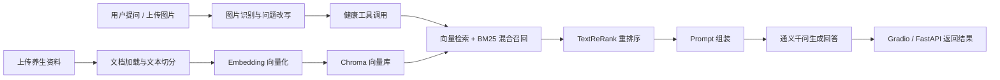

# 健康养生 RAG 智能对话助手

一个面向健康养生科普场景的智能对话机器人。项目同时提供 Gradio 可视化演示入口和 FastAPI 后端 API，结合 LangChain、Chroma、BM25、DashScope 通义千问和多模态图片识别，实现本地知识库问答、健康养生建议、用户画像、多轮会话和图片辅助分析。

> 本项目仅用于健康养生科普与学习演示，不提供医学诊断，不能替代医生或专业医疗建议。

## 一分钟体验

```bash
git clone https://github.com/alln-hank/rag-health-assistant.git
cd rag-health-assistant
python -m venv .venv
.venv\Scripts\activate
pip install -r requirements.txt
copy .env.example .env
python main.py
```

启动后打开终端输出的本地地址，上传 `examples/health_knowledge_sample.md`，点击“构建知识库”，然后可以提问：

```text
湿气重有什么表现，日常怎么调理？
最近睡眠浅，适合怎样调整作息和饮食？
脾胃不舒服，饮食上应该注意什么？
身高170cm，体重70kg，帮我算一下BMI并给点建议
体重60kg，每天喝多少水比较合适？
如果我早上7点起床，晚上几点睡比较好？
```

## 核心功能

- 本地知识库 RAG：支持上传 PDF、DOCX、TXT、MD 文档并构建向量知识库。
- 混合检索：结合 Chroma 向量检索、BM25 关键词检索和 DashScope 重排序。
- 智能对话：支持多轮问答、会话切换、上下文记忆和用户画像。
- 图片识别：支持上传舌象、食材等健康相关图片，并将识别结果融入回答。
- 健康工具调用：支持 BMI 计算、饮水量估算、睡眠作息规划和运动心率估算，并将工具结果注入回答。
- FastAPI 接口化：提供聊天、流式聊天、知识库构建、图片识别和健康检查接口，便于后续接入 Vue/React 前端。
- 可选 Redis：支持 Redis 接口限流和回答缓存；未配置 Redis 时自动退回内存模式。
- 健康安全边界：对危险信号进行提醒，回答中保留必要免责声明。
- 可视化界面：使用 Gradio 构建深色科技风健康养生聊天面板。

## 项目流程



## 文档导航

- [架构说明](docs/ARCHITECTURE.md)
- [FastAPI 接口说明](docs/API.md)
- [Redis 可选配置说明](docs/REDIS.md)
- [示例知识库](examples/health_knowledge_sample.md)

## 技术栈

- Python
- Gradio
- FastAPI / Uvicorn
- LangChain / LangChain Community
- ChromaDB
- rank-bm25 / jieba
- Redis
- DashScope: ChatTongyi、TextReRank、MultiModalConversation

推荐 Python 版本：`3.10` - `3.12`。

## 快速开始

### 1. 克隆项目

```bash
git clone https://github.com/alln-hank/rag-health-assistant.git
cd rag-health-assistant
```

### 2. 创建虚拟环境

```bash
python -m venv .venv
```

Windows:

```bash
.venv\Scripts\activate
```

macOS / Linux:

```bash
source .venv/bin/activate
```

### 3. 安装依赖

```bash
pip install -r requirements.txt
```

### 4. 配置环境变量

复制环境变量模板：

```bash
copy .env.example .env
```

macOS / Linux:

```bash
cp .env.example .env
```

然后编辑 `.env`：

```env
DASHSCOPE_API_KEY=your_dashscope_api_key_here
```

### 5. 启动 Gradio 应用

```bash
python main.py
```

Windows 也可以双击或执行：

```bash
scripts\start_gradio.bat
```

启动后终端会输出本地访问地址，例如：

```text
http://127.0.0.1:7860
```

### 6. 启动 FastAPI 后端

如果需要接口化服务，使用：

```bash
uvicorn backend.app.main:app --reload
```

Windows 也可以执行：

```bash
scripts\start_api.bat
```

启动后访问：

```text
http://127.0.0.1:8000/docs
```

Redis 是可选项，不安装也能运行。如果本机已安装 Redis，可在 `.env` 中配置：

```env
REDIS_URL=redis://localhost:6379/0
RATE_LIMIT=10
RATE_WINDOW_SECONDS=60
CACHE_TTL_SECONDS=3600
```

如果不配置 `REDIS_URL`，后端会自动使用内存限流和缓存。

## 使用方式

1. 在左侧上传健康养生资料，点击“构建知识库”。
2. 在中间聊天框输入问题，例如“最近睡眠浅，适合怎样调理？”。
3. 可在右侧上传舌象或食材图片，发送问题时系统会结合图片识别结果回答。
4. 可填写用户画像，让回答更贴合年龄、性别和健康关注点。

如果只是想快速验证 RAG 效果，可以直接上传：

```text
examples/health_knowledge_sample.md
```

## FastAPI 接口

常用接口：

```text
GET  /api/health
POST /api/chat
POST /api/chat/stream
GET  /api/chat/sessions
DELETE /api/chat/sessions/{session_id}
GET  /api/tools
POST /api/tools/run
POST /api/knowledge/upload
POST /api/knowledge/build
GET  /api/knowledge/status
POST /api/image/analyze
```

聊天接口示例：

```bash
curl -X POST "http://127.0.0.1:8000/api/chat" ^
  -H "Content-Type: application/json" ^
  -d "{\"message\":\"最近睡眠浅，适合怎样调理？\",\"user_profile\":{\"age\":\"25\",\"gender\":\"保密\",\"health\":\"经常熬夜\"}}"
```

健康工具调用示例：

```bash
curl -X POST "http://127.0.0.1:8000/api/tools/run" ^
  -H "Content-Type: application/json" ^
  -d "{\"text\":\"身高170cm，体重70kg，帮我算一下BMI\"}"
```

## 评估

项目提供了一个简单的评估脚本：

```bash
python evaluate.py
```

评估数据位于 `eval_data.json`，当前指标包括：

- Recall@K
- 答案关键词覆盖率

## 项目结构

```text
rag_project/
  backend/
    app/
      main.py            # FastAPI 应用入口
      config.py          # 环境变量和运行配置
      schemas.py         # API 请求/响应模型
      routers/           # API 路由
      services/          # RAG、聊天、图片识别、健康工具、缓存限流服务
  main.py               # Gradio 应用入口
  evaluate.py           # RAG 检索与回答质量评估脚本
  eval_data.json        # 评估问题和关键词
  docs/                 # 架构、API、Redis 说明文档
  examples/             # 可直接上传体验的示例知识库
  scripts/              # Windows 启动脚本
  requirements.txt      # Python 依赖
  .env.example          # 环境变量模板
  .gitignore            # Git 忽略规则
  LICENSE               # 开源许可证
```

运行过程中生成的 `chroma_db/`、`uploads/`、`app.log`、`.env` 不会上传到 GitHub。

## 常见问题

### 没有 Redis 能不能运行？

可以。Redis 是可选能力，不配置 `REDIS_URL` 时 FastAPI 会自动使用内存限流和缓存。

### 为什么回答提示缺少 DASHSCOPE_API_KEY？

需要复制 `.env.example` 为 `.env`，并填写你自己的 DashScope API Key：

```env
DASHSCOPE_API_KEY=your_dashscope_api_key_here
```

### 为什么刚启动时知识库为空？

`chroma_db/` 是本地运行数据，不会上传到 GitHub。首次运行需要上传资料并点击“构建知识库”。可以先用 `examples/health_knowledge_sample.md` 体验。

## Roadmap

- 将 Vue3 前端接入当前 FastAPI 后端，实现完整前后端分离。
- 增加 MySQL 会话持久化，实现长期多轮会话保存和删除。
- 增加文档来源引用和检索片段展示。
- 增加上传文件去重、删除知识库、重建知识库功能。
- 增加更多评估指标和测试用例。
- 后续可选：提供 Docker 部署配置。

## License

MIT

如果这个项目对你有帮助，欢迎 Star 支持。
